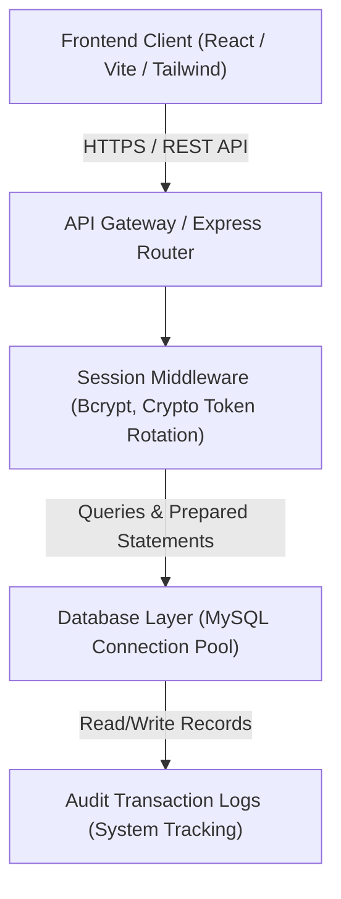
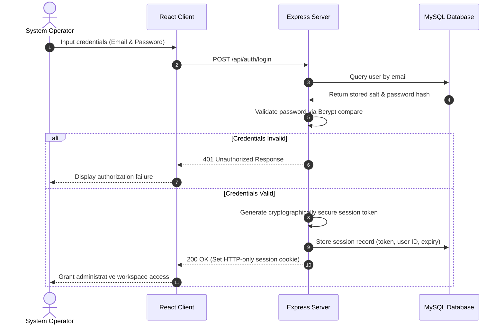
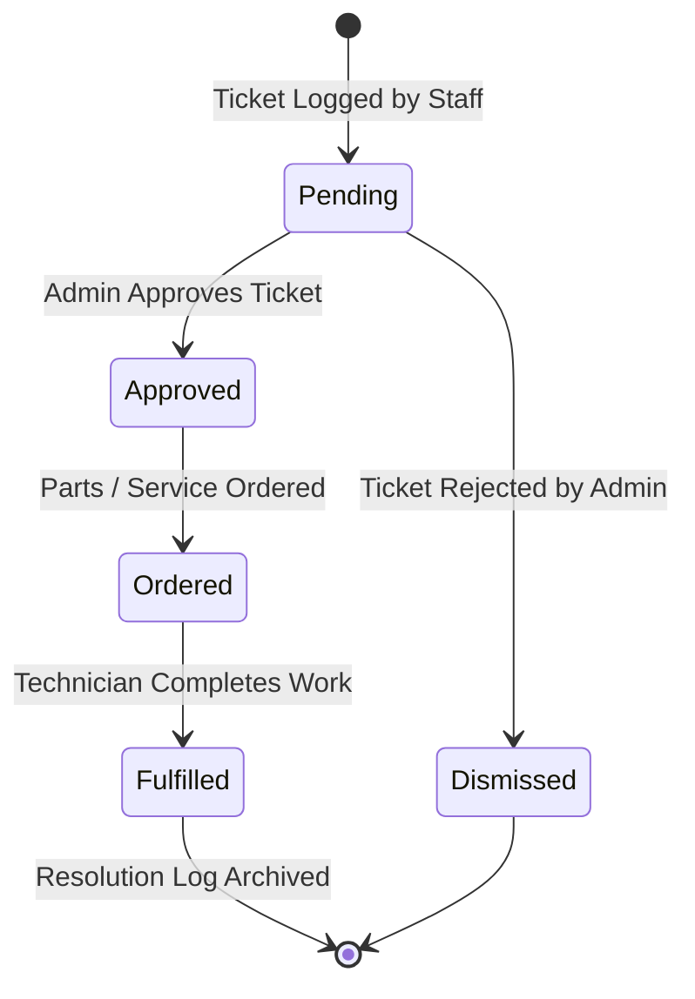

# Swiss Side Management Suite

The Swiss Side Management Suite is an institutional-grade, highly optimized facility and stock management platform designed for high-performance sports training centers and lodging environments. The suite provides reactive inventory metrics, self-healing database architecture, detailed transaction logs, role-based configuration, and automated maintenance lifecycles across five separate facility departments.

---

## Technical Architecture

The application is structured as a decoupled client-server architecture consisting of an optimized React single-page application and a reactive Node.js Express REST API backed by an transactional MySQL database.

### System Topology Diagram



### Authentication Sequence Flow



### Maintenance Ticket Lifecycle



---

## Database Schema Structure

The platform implements strict schema typing with self-healing migration capabilities integrated directly into the system boot cycle. The main database structures are outlined below:

### Data Tables Schema

| Table Name | Primary Purpose | Key Fields | Constraints / Relations |
| :--- | :--- | :--- | :--- |
| `users` | Identity and Access Control | `id`, `email`, `password_hash`, `role`, `failed_attempts`, `lock_until`, `is_active` | Unique index on `email` |
| `needs` | Unified Procurement & Maintenance Tickets | `id`, `item`, `department`, `urgency`, `notes`, `status`, `technician_name`, `resolved_at`, `resolution_notes`, `logged_by`, `resolved_by` | Foreign key `logged_by` -> `users(id)`, `resolved_by` -> `users(id)` |
| `laundry_items` | Laundry Consumables and Equipment | `id`, `name`, `quantity`, `unit`, `reorder_level`, `is_folder`, `parent_id` | Self-referencing foreign key on `parent_id` for folder structure |
| `shop_items` | Commercial Retail Stock Items | `id`, `name`, `quantity`, `unit`, `reorder_level`, `is_folder`, `parent_id` | Self-referencing foreign key on `parent_id` for folder structure |
| `supplies_items` | General Utility Consumables | `id`, `name`, `quantity`, `unit`, `reorder_level`, `is_folder`, `parent_id` | Self-referencing foreign key on `parent_id` for folder structure |
| `gym_items` | Athletic Gear and Training Machinery | `id`, `name`, `quantity`, `unit`, `reorder_level`, `is_folder`, `parent_id` | Self-referencing foreign key on `parent_id` for folder structure |
| `transactions` | Historical Audit Logs of Stock | `id`, `item_id`, `department`, `action`, `quantity`, `reason`, `action_by` | Foreign key `action_by` -> `users(id)` |

---

## Security Controls and Posture

To ensure regulatory security compliance, the platform implements the following operational safeguards:

### 1. Data Integrity and Prepared Statements
All SQL queries executed by the application use parameterized inputs and prepared statements via the `mysql2` client pool. This isolates database commands from input data, preventing SQL Injection vulnerabilities.

### 2. Session Integrity and Token Rotation
Sessions are not stored client-side in plaintext. The system uses a cryptographically secure token generator to mint random session IDs. These IDs are stored on the server side and compared against a secure session cookie.

### 3. Password Cryptography
Password storage utilizes Bcrypt with a high work factor salt to resist brute-force cryptographic attacks. Cleartext passwords are never logged, stored, or transmitted internally.

### 4. Account Brute-Force Lockout
To counter brute-force password guessing, the system tracks failed login attempts. Upon reaching five consecutive failures, the target account is automatically locked for 15 minutes, updating the `lock_until` field in the active user record.

### 5. Automated Database Self-Healing (V37 Upgrade)
The backend service automatically analyzes database state upon start-up. If any columns related to technicians, resolution timestamps, or administrative resolution notes are missing from the `needs` table, the self-healing migration layer runs structured `ALTER TABLE` queries automatically to bring the database to the current schema.

---

## Role-Based Access Control

The application implements a strict two-tiered permission matrix:

| Action / Operation | Staff Role Permissions | Administrator Role Permissions |
| :--- | :---: | :---: |
| Access Dashboard Metrics | Granted | Granted |
| Log Single/Bulk Maintenance | Granted | Granted |
| Submit Procurement Requests | Granted | Granted |
| Restock & Withdraw Items | Granted | Granted |
| Add/Modify Items or Folders | Denied | Granted |
| Resolve Active Maintenance Tickets | Denied | Granted |
| Permanently Delete Records | Denied | Granted |
| Administrative System Health & Audit Logs | Denied | Granted |

---

## Installation and Configuration

### Prerequisites
- Node.js (version 18 or newer)
- MySQL Server (version 8.0 or newer)

### Environment Setup
Create a `.env` file in the root `backend` directory based on the following pattern:

```env
PORT=5000
DB_HOST=127.0.0.1
DB_USER=your_database_user
DB_PASSWORD=your_database_password
DB_NAME=swiss_side_db
SESSION_SECRET=your_cryptographically_secure_long_secret_string
JWT_SECRET=your_jwt_signing_key_token
EMAIL_HOST=your_smtp_server_hostname
EMAIL_PORT=587
EMAIL_USER=your_smtp_authentication_username
EMAIL_PASSWORD=your_smtp_authentication_password
```

Create a `.env` file in the root `frontend` directory:

```env
VITE_API_URL=http://localhost:5000/api
```

### Installation Steps

1. **Extract/Clone Source Repository**:
   Ensure all package directories are loaded.

2. **Backend Setup**:
   ```bash
   cd backend
   npm install
   ```

3. **Frontend Setup**:
   ```bash
   cd ../frontend
   npm install
   ```

4. **Database Initialization**:
   Create the database specified in `DB_NAME`. Run the structure defined in `backend/schema.sql` to populate the initial framework.

5. **Start Application Locally**:
   - Run the API service:
     ```bash
     cd ../backend
     npm run dev
     ```
   - Run the Frontend client:
     ```bash
     cd ../frontend
     npm run dev
     ```

---

## Deployment Packaging Pipelines (V37 Scripts)

Automated build and packaging pipelines are supplied for production deployment and secure offsite backups. These PowerShell scripts can be run directly from the workspace root:

### 1. Production Bundle Generation
Compiles optimized client assets via Vite, syncs build directories to the static backend directory, cleans up temporary build files, and generates a lightweight production deployment package.
```powershell
powershell.exe -ExecutionPolicy Bypass -File .\create_production_zip_v37.ps1
```
- **Output File**: `SwissSide_Production_V37_Flat.zip`
- **Output Location**: Workspace root

### 2. Full Developer Backup
Presents a developer snapshot of the entire workspace, excluding large runtime dependency folders (`node_modules`) and temporary metadata files, creating a perfect source restore point.
```powershell
powershell.exe -ExecutionPolicy Bypass -File .\create_full_codebase_zip_v37.ps1
```
- **Output File**: `SwissSide_Full_Codebase_Backup_V37.zip`
- **Output Location**: Workspace root
